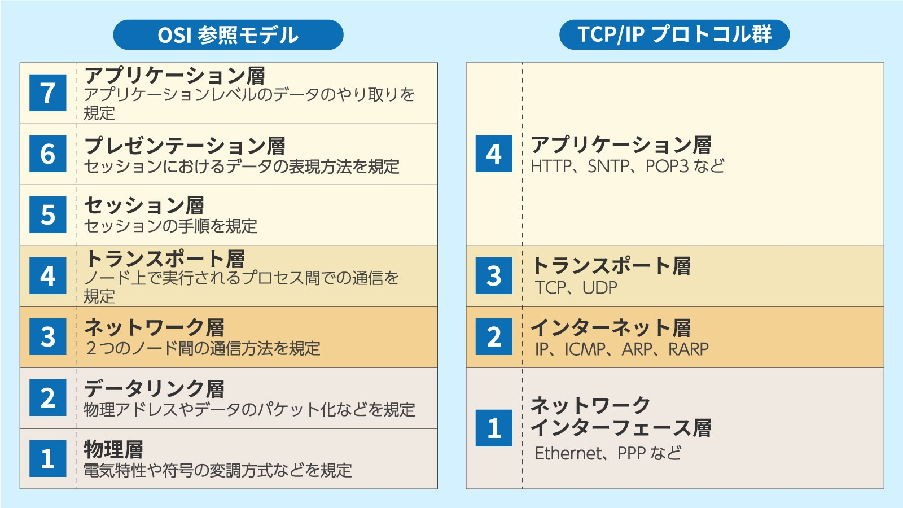
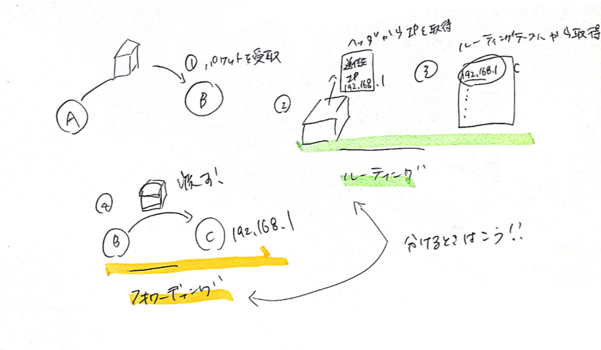

### TCP/IPとは
- プロトコルの一種。
- IP=目的地まで荷物を届ける役割
- TCP=荷物が目的地までちゃんと届いたかを確認する役割

- TCPはトランスポート層、IPはネットワーク層に対応するプロトコル


引用:https://www.sbbit.jp/article/cont1/12099

### 環境
`bento/ubuntu-18.04`

```bash
# git clone後
$vagrant up
$vagrant ssh
```

### ipアドレスを確認
```bash
$ ip address show
1: lo: <LOOPBACK,UP,LOWER_UP> mtu 65536 qdisc noqueue state UNKNOWN group default qlen 1000
    link/loopback 00:00:00:00:00:00 brd 00:00:00:00:00:00
    inet 127.0.0.1/8 scope host lo
       valid_lft forever preferred_lft forever
    inet6 ::1/128 scope host 
       valid_lft forever preferred_lft forever
2: eth0: <BROADCAST,MULTICAST,UP,LOWER_UP> mtu 1500 qdisc fq_codel state UP group default qlen 1000
    link/ether 08:00:27:2e:fc:18 brd ff:ff:ff:ff:ff:ff
    inet 10.0.2.15/24 brd 10.0.2.255 scope global dynamic eth0
       valid_lft 85075sec preferred_lft 85075sec
    inet6 fe80::a00:27ff:fe2e:fc18/64 scope link 
       valid_lft forever preferred_lft forever
```
- `127.0.0.1/8`は**ループバックアドレス**で自分自身を表す
- `10.0.2.15/24`はホストのIDアドレス

### pingの詳細を確認 
```bash
# 別タブで $ping -c 3 8.8.8.8を叩く
vagrant@vagrant:~$ sudo tcpdump -tn -i any icmp
tcpdump: verbose output suppressed, use -v or -vv for full protocol decode
listening on any, link-type LINUX_SLL (Linux cooked), capture size 262144 bytes
IP 10.0.2.15 > 8.8.8.8: ICMP echo request, id 1745, seq 1, length 64　#ICMPのエコーリクエスト　ホストのIPから8.8.8.8へ
IP 8.8.8.8 > 10.0.2.15: ICMP echo reply, id 1745, seq 1, length 64 #ICMPのエコーリプライ 8.8.8.8からホストのIPへ
IP 10.0.2.15 > 8.8.8.8: ICMP echo request, id 1745, seq 2, length 64
IP 8.8.8.8 > 10.0.2.15: ICMP echo reply, id 1745, seq 2, length 64
IP 10.0.2.15 > 8.8.8.8: ICMP echo request, id 1745, seq 3, length 64
IP 8.8.8.8 > 10.0.2.15: ICMP echo reply, id 1745, seq 3, length 64
```
- pingの通信はIPとICMPで成り立っている


### パケットがどのような道順(ルータ)を通って目的地まで届くのか確認する
```bash
#コマンドをインストール
$sudo apt install traceroute

$ traceroute -n 8.8.8.8
traceroute to 8.8.8.8 (8.8.8.8), 30 hops max, 60 byte packets
 1  10.0.2.2  0.143 ms  0.087 ms  0.190 ms
 2  192.168.10.221  4.042 ms  3.921 ms  3.898 ms
 3  163.139.102.9  11.524 ms  11.512 ms  11.499 ms
 4  163.139.25.193  8.469 ms  9.164 ms  9.101 ms
 5  163.139.153.17  8.829 ms  9.604 ms  9.602 ms
 6  163.139.37.98  14.111 ms 163.139.37.102  12.884 ms 163.139.37.98  12.936 ms
 7  163.139.78.2  12.849 ms  9.797 ms  9.886 ms
 8  * * *
 9  8.8.8.8  10.006 ms  9.998 ms  10.969 ms
```

- 通過するルータの数は **ホップ数**という。この例だと7

### 次にパケットをどこに渡せばいいか確認する
```bash
$ip route show
# ルーティングテーブル
# 何も指定されていない場合は10.0.2.2に飛ばす！ default = デフォルトルートと呼ぶ
default via 10.0.2.2 dev eth0 proto dhcp src 10.0.2.15 metric 100

# devがネクストホップとなっているものは、該当する宛先についてはそのネットワークインターフェース(eth0)を使って通信する
# ルータを介さず通信できるという意味（同じセグメント内だから）
10.0.2.0/24 dev eth0 proto kernel scope link src 10.0.2.15 
10.0.2.2 dev eth0 proto dhcp scope link src 10.0.2.15 metric 100 
```
- `traceroute`を叩いた時に、`10.0.2.2`を最初に通っていることがわかる
- **ルーティング**とは、ネクストホップにパケットを転送すること

- **ルーティング**と**フォワーディング**をひとまとめで**ルーティング**と表すことが多いが、分けるときは↓

- 例（A→Cにパケットを渡すとき）
<br/>

