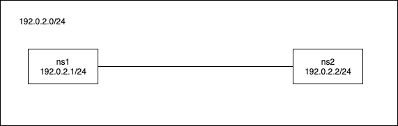

### NetworkNamespace

- Dockerなどと同じ技術(コンテナ仮想化技術)

- わかりやすい↓
https://christina04.hatenablog.com/entry/network-namespace

- NetworkNamespaceを使うと、NICとルーティングテーブルが独立する

- ネットワークインターフェース＝NIC

### NetworkNamespaceのコマンド
```bash
$ip netns add <name> # 追加
$ip netns list # 確認
$ip netns exec <name> <command> #コマンドを実行
$ip netns delete <name> #削除
```
- dockerでもコンテナで実行するときは`docker exec`をつかうし、根本は一緒。

```bash
# vagrant上で以下実行するとコンテナ? NetworkNamespaceにつながる
# dockerといっしょ！
vagrant@vagrant:~$ sudo ip netns exec ns1 bash
root@vagrant:~# 
```

### NetworkNamespaceを繋ぐ(同じセグメント内)
- **veth**(仮想的なNIC)を使って繋ぐ。

- 図


#### 疎通の流れ
1. NetworkNamespaceの追加(ip netns add)
2. vethの作成・接続(ip link add)
3. vethを使えるようにする(ip link set `vethの名前` netns `対象のns`)
4. ipアドレスを付与(ip address add)
5. NICをUP(ip link set `vethの名前` up)


### vethでns1とns2を繋ぐ
```bash
$sudo ip link add ns1-veth0 type veth peer name ns2-veth0

# 確認
$ip link show
1: lo: <LOOPBACK,UP,LOWER_UP> mtu 65536 qdisc noqueue state UNKNOWN mode DEFAULT group default qlen 1000
    link/loopback 00:00:00:00:00:00 brd 00:00:00:00:00:00
2: eth0: <BROADCAST,MULTICAST,UP,LOWER_UP> mtu 1500 qdisc fq_codel state UP mode DEFAULT group default qlen 1000
    link/ether 08:00:27:2e:fc:18 brd ff:ff:ff:ff:ff:ff
3: ns2-veth0@ns1-veth0: <BROADCAST,MULTICAST,M-DOWN> mtu 1500 qdisc noop state DOWN mode DEFAULT group default qlen 1000
    link/ether b6:00:75:6c:b8:6e brd ff:ff:ff:ff:ff:ff
4: ns1-veth0@ns2-veth0: <BROADCAST,MULTICAST,M-DOWN> mtu 1500 qdisc noop state DOWN mode DEFAULT group default qlen 1000
    link/ether fe:9d:0c:9d:22:c4 brd ff:ff:ff:ff:ff:ff

# vethに絞り込み
$ sudo ip link show | grep veth
3: ns2-veth0@ns1-veth0: <BROADCAST,MULTICAST,M-DOWN> mtu 1500 qdisc noop state DOWN mode DEFAULT group default qlen 1000
4: ns1-veth0@ns2-veth0: <BROADCAST,MULTICAST,M-DOWN> mtu 1500 qdisc noop state DOWN mode DEFAULT group default qlen 1000
```
- 2本でペア

### システム領域にあるvethをNetworkNamespaceに所属させる
```bash
# ns1に所属
$sudo ip link set ns1-veth0 netns ns1

#ns1に所属させた後に確認してみるとns1のvethがなくなっている(移動した)
$ip link show | grep veth
3: ns2-veth@if4: <BROADCAST,MULTICAST> mtu 1500 qdisc noop state DOWN mode DEFAULT group default qlen 1000

#ns2も
$sudo ip link set ns2-veth0 netns ns2
```
- ns1とns2をLANケーブルに繋げたイメージ

### ipを付与

```bash
#IPアドレス(ドキュメンテーションアドレス)の付与
# ns1に192.0.2.1/24を付与
$sudo ip netns exec ns1 ip address add 192.0.2.1/24 dev ns1-veth0

#ns2に192.0.2.2/24を付与
$sudo ip netns exec ns2 ip address add 192.0.2.2/24 dev ns2-veth0
```

```bash
#IPを付与する前
$sudo ip netns exec ns2 ip address show
1: lo: <LOOPBACK> mtu 65536 qdisc noop state DOWN group default qlen 1000
    link/loopback 00:00:00:00:00:00 brd 00:00:00:00:00:00
3: ns2-veth0@if4: <BROADCAST,MULTICAST> mtu 1500 qdisc noop state DOWN group default qlen 1000
    link/ether 8a:1e:d7:e2:90:79 brd ff:ff:ff:ff:ff:ff link-netnsid 0

#IPを付与した後
$ sudo ip netns exec ns2 ip address show
1: lo: <LOOPBACK> mtu 65536 qdisc noop state DOWN group default qlen 1000
    link/loopback 00:00:00:00:00:00 brd 00:00:00:00:00:00
3: ns2-veth0@if4: <BROADCAST,MULTICAST> mtu 1500 qdisc noop state DOWN group default qlen 1000
    link/ether 8a:1e:d7:e2:90:79 brd ff:ff:ff:ff:ff:ff link-netnsid 0
    inet 192.0.2.2/24 scope global ns2-veth0 # 付与されている！
       valid_lft forever preferred_lft forever
```


### NICのstatusをUP

```bash
# ns1でstatusを確認 $sudo ip netns exec ns1 bash
$ip link show ns1-veth0 | grep state
4: ns1-veth0@if3: <BROADCAST,MULTICAST> mtu 1500 qdisc noop state DOWN mode DEFAULT group default qlen 1000

# ns2も同様
$ip link show ns2-veth0 | grep state
3: ns2-veth0@if4: <BROADCAST,MULTICAST> mtu 1500 qdisc noop state DOWN mode DEFAULT group default qlen 1000

# UP
# ns1
$ip link set ns1-veth0 up

$ip link show ns1-veth0 | grep state
#UPされた！
4: ns1-veth0@if3: <NO-CARRIER,BROADCAST,MULTICAST,UP> mtu 1500 qdisc noqueue state LOWERLAYERDOWN mode DEFAULT group default qlen 1000

# ns2も同様（略）
```

### 疎通確認
```bash
# ns1からns2宛にpingを叩く
$ping -c 3 192.0.2.2
PING 192.0.2.2 (192.0.2.2) 56(84) bytes of data.
64 bytes from 192.0.2.2: icmp_seq=1 ttl=64 time=0.044 ms
64 bytes from 192.0.2.2: icmp_seq=2 ttl=64 time=0.040 ms
64 bytes from 192.0.2.2: icmp_seq=3 ttl=64 time=0.034 ms

--- 192.0.2.2 ping statistics ---
3 packets transmitted, 3 received, 0% packet loss, time 2040ms
rtt min/avg/max/mdev = 0.034/0.039/0.044/0.006 ms
```
- ちなみに適当なアドレス(存在しない)で叩いたとき
```bash
$ping -c 3 192.0.2.5
PING 192.0.2.5 (192.0.2.5) 56(84) bytes of data.

--- 192.0.2.5 ping statistics ---
3 packets transmitted, 0 received, 100% packet loss, time 2043ms
```

- 同じ**セグメント**内であるときはルータが不要！
- セグメントの判断は `192.0.2.1/24` の `/24`(24ビット)を区切りに考える。

- 192.0.2.1/24を10進数に変換


- ネットワーク部が同じだと、同じセグメントといえる


### ルータを使った疎通(異なるセグメントで)

#### 疎通の流れ
1. NetworkNamespaceの追加(ip netns add)
2. vethの作成・接続(ip link add)
3. vethを使えるようにする(ip link set `vethの名前` netns `対象のns`)
4. ipアドレスを付与(ip address add)
5. NICをUP(ip link set `vethの名前` up)
<hr>
1~5までは、同じセグメント内と一緒で、異なるセグメントで通信する場合は以下手順が必要

6. ルーティングテーブルにルーティングエントリを追加する
7. カーネルのパラメータを有効にする(routerの)

```bash
#vethを作る
$sudo ip link add ns1-veth0 type veth peer name gw-veth0

$sudo ip link add ns2-veth0 type veth peer name gw-veth1 

# Natwork Namespaceに所属させる
# ns1
$sudo ip link set ns1-veth0 netns ns1

# router
$sudo ip link set gw-veth0 netns router
$sudo ip link set gw-veth1 netns router

#ns2
$sudo ip link set ns2-veth0 netns ns2

# NICをUPする (sudo ip netns exec <ns> bash)
#ns1
$ip link set ns1-veth0 up

#router
$ip link set gw-veth0 up
$ip link set gw-veth1 up

# ns2
$ip link set ns2-veth0 up
```

- 192.0.2のセグメントで設定
```bash
#ns1 192.0.2.1/24を付与
$ip address add 192.0.2.1/24 dev ns1-veth0

#router 192.0.2.254/24を付与
$ip address add 192.0.2.254/24 dev gw-veth0
```

- 198.51.100のセグメントで設定
```bash
#router 198.51.100.254/24を付与
$ip address add 198.51.100.254/24 dev gw-veth1

#ns2
$ip address add 198.51.100.1/24 dev ns2-veth0
```

### ルーティングテーブルにルーティングエントリを追加する

```bash
# ns1 デフォルトルートを追加（他の宛先に一致しない時に使われる）
# routerのIP（同じセグメント）
$ip route add default via 192.0.2.254

#ns2も
$ip route add default via 198.51.100.254
```

### カーネルのパラメータを有効にする

```bash
# router
$sysctl net.ipv4.ip_forward=1
net.ipv4.ip_forward = 1
```
https://access.redhat.com/documentation/ja-jp/red_hat_enterprise_linux/6/html/load_balancer_administration/s1-lvs-forwarding-vsa

### 疎通
```bash
$ping -c 3 198.51.100.1 -I 192.0.2.1

PING 198.51.100.1 (198.51.100.1) from 192.0.2.1 : 56(84) bytes of data.
64 bytes from 198.51.100.1: icmp_seq=1 ttl=63 time=0.093 ms
64 bytes from 198.51.100.1: icmp_seq=2 ttl=63 time=0.050 ms
64 bytes from 198.51.100.1: icmp_seq=3 ttl=63 time=0.067 ms

--- 198.51.100.1 ping statistics ---
3 packets transmitted, 3 received, 0% packet loss, time 2034ms
rtt min/avg/max/mdev = 0.050/0.070/0.093/0.017 ms
```
疎通できた！！

### NetworkNamespaceを一括で消す

```bash
$for ns in $(ip netns list | awk '{print $1}'); do sudo ip netns delete $ns; done
```

進捗
Error: Nexthop has invalid gateway.
